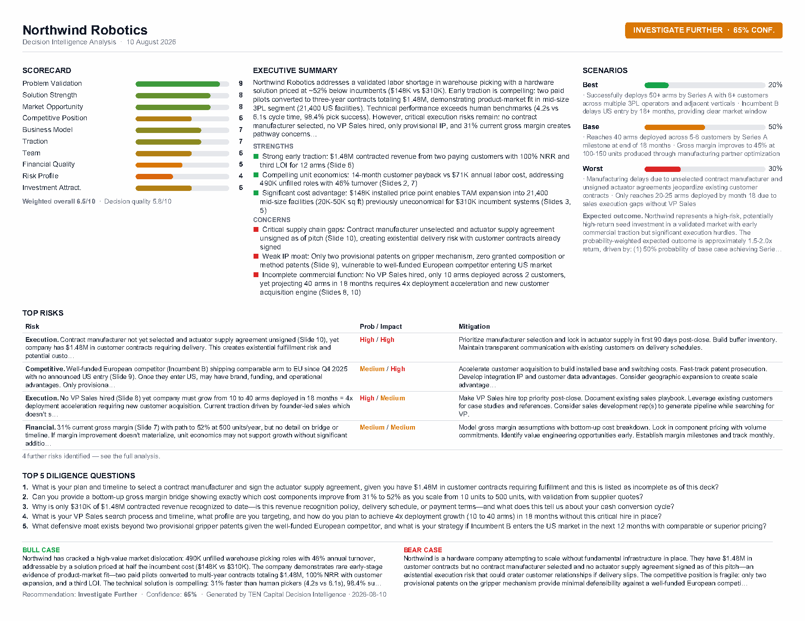

# Pitch Deck Decision Intelligence Analyzer

Turn an investor pitch deck (`.pdf` or `.pptx`) into a single-page, print-ready
Decision Intelligence report — from the command line, or as a web app.



*Generated from [`samples/sample_deck.pdf`](samples/sample_deck.pdf) — a synthetic
deck included for smoke-testing.*

---

## Quick Start

```bash
# 1. Create and activate a virtual environment
python -m venv .venv
.venv\Scripts\activate          # Windows
# source .venv/bin/activate     # macOS / Linux

# 2. Install
pip install -r requirements.txt
pip install -e .

# 3. Configure your API key
cp .env.example .env            # then edit .env and set ANTHROPIC_API_KEY

# 4. Run
pitch-analyzer analyze samples/sample_deck.pdf -o report.pdf
```

Output:

```
OK Read 10 slide(s), 3,057 characters, 10 image(s).
OK Analysis complete.

INVESTIGATE FURTHER - 65% confidence - weighted 6.5/10
OK Report written to report.pdf
```

A run takes roughly 2–4 minutes, most of it the model call.

### Run the web app locally

```bash
export APP_PASSWORD=choose-a-password        # set APP_PASSWORD=... on Windows
uvicorn pitch_analyzer.web:app --app-dir src --reload --port 8000
```

Open <http://127.0.0.1:8000> and sign in as `ten` with that password. Set
`ALLOW_ANONYMOUS=1` instead of `APP_PASSWORD` to run without a login on your own
machine.

---

## CLI

```bash
pitch-analyzer analyze <DECK_PATH> [OPTIONS]
```

| Option | Description |
|---|---|
| `--output` / `-o` PATH | Output PDF path. Defaults to `<deck_stem>_analysis.pdf`. |
| `--orient landscape\|portrait` | Page orientation. Default `landscape`. |
| `--model TEXT` | Override the LLM model. Default `claude-sonnet-4-5`. |
| `--verbose` / `-v` | Stream analysis progress to stdout. |
| `--no-images` | Skip image extraction — faster and cheaper, less context. |
| `--logo PATH` | Optional logo image for the report header. |

`DECK_PATH` must be `.pdf` or `.pptx`; anything else is rejected before any API
call is made.

**Model choice.** The default is `claude-sonnet-4-5` as specified for this
project. `--model claude-opus-5` is a drop-in upgrade if you want the stronger
model on a given deck.

---

## Web app

A FastAPI front end wraps the same pipeline, in TEN Capital's dark navy /
coral-amber-teal identity.

| Upload | Result |
|---|---|
|  |  |

Because an analysis takes minutes — far too long to hold an HTTP request open —
uploads become **jobs**: submit, poll, download.

The upload page validates the file client-side (extension and size) before
anything is sent, supports drag-and-drop, and keeps orientation / model /
image-context behind an **Analysis options** disclosure so the default path is a
single click. The job page polls for progress, shows the log as it accumulates,
and ends on a colour-coded verdict with the weighted score, confidence, and
slide count. Errors render as styled pages for browsers and stay JSON for API
clients.

| Route | Auth | Purpose |
|---|---|---|
| `GET /` | yes | Upload form (deck, orientation, model, images on/off) |
| `POST /analyze` | yes | Submits a job. Returns `303` to the job page, or `202` + JSON when `Accept: application/json` |
| `GET /jobs/{id}` | yes | Live progress page |
| `GET /jobs/{id}/status` | yes | JSON job status for polling |
| `GET /jobs/{id}/report.pdf` | yes | The finished one-pager |
| `GET /healthz` | no | Platform health check |

Scriptable end to end:

```bash
JOB=$(curl -s -u ten:$APP_PASSWORD -H "Accept: application/json" \
  -F "deck=@deck.pdf" -F "include_images=off" \
  https://your-app.up.railway.app/analyze | jq -r .job_id)

curl -s -u ten:$APP_PASSWORD https://your-app.up.railway.app/jobs/$JOB/status
curl -s -u ten:$APP_PASSWORD -o report.pdf \
  https://your-app.up.railway.app/jobs/$JOB/report.pdf
```

### Authentication

**Every route except `/healthz` is behind HTTP Basic auth.** This is deliberate:
each upload spends your Anthropic credits, so an open endpoint is somebody
else's free analysis budget. Set `APP_PASSWORD` (username defaults to `ten`,
override with `APP_USERNAME`). With neither `APP_PASSWORD` nor
`ALLOW_ANONYMOUS=1` set, the app returns `503` rather than starting up
unprotected.

---

## Deploying to Railway

The repo carries `Procfile`, `railway.json`, and `.python-version`, so a
deployment is configuration only — no build script to write.

1. **Push the repo to GitHub.**
2. **Railway → New Project → Deploy from GitHub repo**, and pick it. Nixpacks
   detects Python, installs `requirements.txt`, and uses the start command in
   `railway.json`.
3. **Set the variables** under the service's *Variables* tab:

   | Variable | Required | Notes |
   |---|---|---|
   | `ANTHROPIC_API_KEY` | yes | From <https://console.anthropic.com> → API keys |
   | `APP_PASSWORD` | yes | Anything you like; this is the login password |
   | `APP_USERNAME` | no | Defaults to `ten` |
   | `MAX_UPLOAD_MB` | no | Defaults to `25` |
   | `JOB_TTL_MINUTES` | no | Defaults to `60` |
   | `MAX_CONCURRENT_ANALYSES` | no | Defaults to `2` |
   | `DATA_DIR` | no | Defaults to the system temp directory |

   Do **not** set `PORT` — Railway injects it.
4. **Settings → Networking → Generate Domain.**
5. Open the domain and sign in. `/healthz` should return `{"status":"ok"}`
   without credentials.

Redeploy on every push to the default branch is Railway's default.

### What to know about this deployment

- **Keep it at one replica.** Job state lives in the process, so a second
  instance would not recognise jobs started by the first. `railway.json` pins
  `numReplicas: 1`; scale by raising `MAX_CONCURRENT_ANALYSES` instead.
- **Storage is ephemeral.** Uploads and reports live on local disk and are
  deleted after `JOB_TTL_MINUTES`, or on any redeploy or restart. Download the
  report when it is ready; nothing is archived. Attach a Railway volume and
  point `DATA_DIR` at it if you need reports to survive a restart.
- **Long jobs, short requests.** No request is held open for the analysis, so
  Railway's proxy timeout is not a factor.
- **Cost scales with uploads.** Each analysis is one Claude call, larger with
  slide images attached. The password is the only thing standing between your
  key and the open internet — treat it accordingly, and set spend limits in the
  Anthropic console.
- **Sizing.** Idles at roughly 150 MB RSS; a concurrent analysis adds little
  since the work is mostly waiting on the API. Railway's smallest instance is
  enough.

---

## Document template

[`templates/report_structure.md`](templates/report_structure.md) is the
canonical structure for every report the app produces — page setup, the five
bands, every field with its placeholder, character budget and allowed value set,
and the content rules. Amend that document first when the report format needs to
change.

[`templates/report_template.pdf`](templates/report_template.pdf) is the same
structure rendered as a blank, placeholder-filled one-pager (portrait variant
alongside it). It goes through the real renderer, so it always matches live
output. Regenerate both with:

```bash
python templates/make_report_template.py
```

`tests/test_template.py` fails if the template or the structure document drifts
out of sync with the renderer.

---

## What the report contains

The one-pager is laid out in five bands:

| Band | Content |
|---|---|
| Header | Company name (inferred from the title slide), date, colour-coded recommendation badge with confidence |
| Scorecard | All 10 category scores as red→green gradient bars, plus weighted overall and decision quality |
| Executive summary | Investment thesis, three strengths, three concerns |
| Scenarios | Best / base / worst probability bars, drivers, and the expected risk-adjusted outcome |
| Top risks | Category, description, probability/impact, mitigation |
| Diligence questions | The top five questions for the founder meeting |
| Footer | Bull case, bear case, recommendation, confidence, attribution |

The badge is green for **Invest**, amber for **Investigate Further**, red for
**Pass**.

### Fitting one page

The report is always exactly one page. Before drawing, every band is measured;
if the stack does not fit, the renderer re-lays the page at a smaller type size
(8pt down to a 5.5pt floor, in 0.5pt steps). At each size it finds the largest
text budget that still fits, so **type size is only spent once text has been** —
a normal-length analysis renders at 8pt with nothing clipped.

Two things are bounded by design, and both are disclosed on the page rather than
dropped silently:

- The risks table shows four rows; any remainder is reported as
  *"N further risks identified — see the full analysis."*
- Long free-text fields are clipped with an ellipsis when the analysis is far
  longer than a page can carry.

If the content cannot fit even at 5.5pt, the renderer raises
`LayoutOverflowError` naming the offending section rather than producing a
silently broken page.

---

## How it works

```
ingest.py  →  analyze.py  →  render.py
  PDF/PPTX     Claude API      ReportLab
```

1. **`ingest.py`** — pulls per-slide text (and tables) with `pdfplumber` or
   `python-pptx`, prefixing each slide with a `[Slide N]` marker so the model can
   cite slide numbers. Up to 10 slide images (first, last, and evenly sampled)
   are rendered to JPEG at 1024px wide for the vision request.
2. **`analyze.py`** — sends images then text to the Messages API and validates the
   response against the Pydantic schema in `models.py`. A malformed response is
   retried once with an explicit correction; after two failures the raw response
   is written to `<output>_raw.txt`. Rate limits are retried three times with
   exponential backoff.
3. **`render.py`** — draws the one-pager with ReportLab using only built-in
   Helvetica, so there are no font or image dependencies.

### Errors

| Situation | Behaviour |
|---|---|
| Unsupported file extension | `typer.BadParameter` |
| File not found | `typer.BadParameter` |
| Empty deck (no text extracted) | `RuntimeError("No text could be extracted.")`, exit 1 |
| API auth failure | Prints `Set ANTHROPIC_API_KEY in .env`, exit 1 |
| API rate limit | Retries ×3 with exponential backoff, then exit 1 |
| JSON parse failure after 2 retries | Saves `<output>_raw.txt`, exit 1 |
| Layout overflow at 5.5pt | `LayoutOverflowError` naming the section, exit 1 |

---

## Development

```bash
pip install -e ".[dev]"
pytest -v
```

87 tests cover ingestion (generated PDF and PPTX fixtures), the analysis layer
(mocked Anthropic client, including both retry paths), rendering (page count,
page size, content, the fit search, and the overflow guard), the document
template, and the web app (auth, upload validation, the full job flow, job
expiry, and error rendering). No test makes a network call — an autouse fixture
fails any test that tries to construct a real Anthropic client.

To regenerate the sample deck or the blank template:

```bash
python samples/make_sample_deck.py
python templates/make_report_template.py
```

### Layout

```
src/pitch_analyzer/
├── models.py        Pydantic schema for the analysis
├── ingest.py        PDF / PPTX text + image extraction
├── analyze.py       Anthropic API call, retries, JSON validation
├── render.py        ReportLab one-pager and fit guard
├── cli.py           Typer entry point
├── jobs.py          Background job queue for the web app
├── web.py           FastAPI routes, auth, error pages
└── web_templates/   base · index · job · error (TEN Capital design system)

Procfile · railway.json · .python-version    Railway deployment config

templates/
├── report_structure.md        Canonical document structure (edit this first)
├── make_report_template.py    Renders the blank template
└── report_template.pdf        Blank one-pager, landscape + portrait

samples/
├── make_sample_deck.py        Builds the synthetic deck
├── sample_deck.pdf            Input for smoke tests
└── sample_report.pdf/.png     Example output
```
