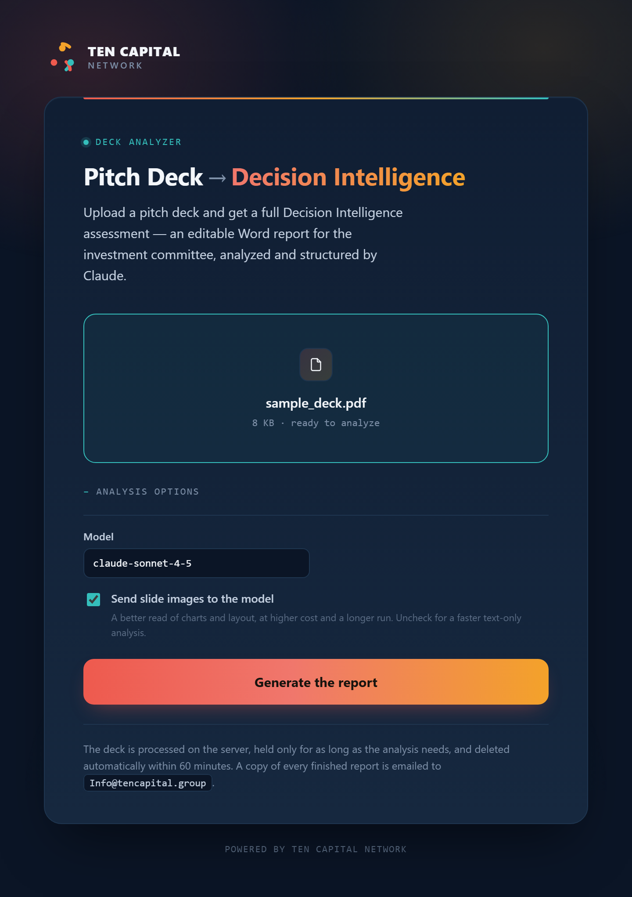
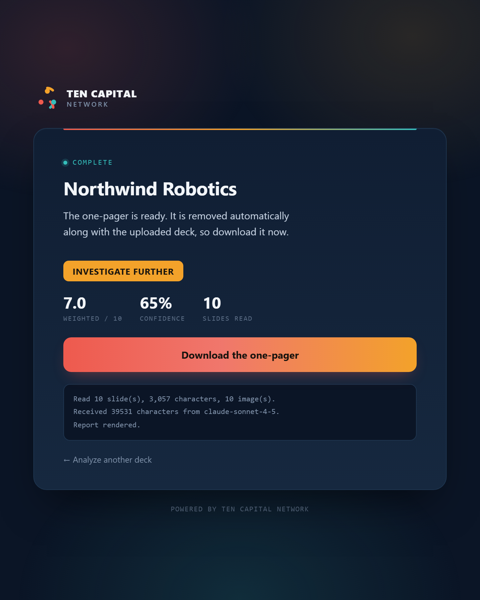

# Pitch Deck Decision Intelligence Analyzer

Turn an investor pitch deck (`.pdf` or `.pptx`) into a full **Decision
Intelligence Assessment** — an editable Word report written for an investment
committee — from the command line, or as a web app.

---

## Quick Start

```bash
# 1. Create and activate a virtual environment
python -m venv .venv
.venv\Scripts\activate          # Windows
# source .venv/bin/activate     # macOS / Linux

# 2. Install
pip install -r requirements.txt
pip install -e .

# 3. Configure your API key
cp .env.example .env            # then edit .env and set ANTHROPIC_API_KEY

# 4. Run
pitch-analyzer analyze samples/sample_deck.pdf -o report.docx
```

Output:

```
OK Read 10 slide(s), 3,057 characters, 10 image(s).
OK Analysis complete.

INVESTIGATE FURTHER - 62% confidence - weighted 4.6/10
OK Report written to report.docx
```

A run takes roughly 5–12 minutes, almost all of it the model call. The report is
long, so the request is streamed to survive that.

### Run the web app locally

```bash
export APP_PASSWORD=choose-a-password        # set APP_PASSWORD=... on Windows
uvicorn pitch_analyzer.web:app --app-dir src --reload --port 8000
```

Open <http://127.0.0.1:8000> and sign in as `ten` with that password. Set
`ALLOW_ANONYMOUS=1` instead of `APP_PASSWORD` to run without a login on your own
machine.

---

## CLI

```bash
pitch-analyzer analyze <DECK_PATH> [OPTIONS]
```

| Option | Description |
|---|---|
| `--output` / `-o` PATH | Output path. Defaults to `<deck_stem>_analysis.docx`. |
| `--model TEXT` | Override the LLM model. Default `claude-sonnet-4-5`. |
| `--verbose` / `-v` | Stream analysis progress to stdout. |
| `--no-images` | Skip image extraction — faster and cheaper, less context. |
| `--no-email` | Skip the email notification for this run. |

`DECK_PATH` must be `.pdf` or `.pptx`; anything else is rejected before any API
call is made.

**Model choice.** The default is `claude-sonnet-4-5` as specified for this
project. `--model claude-opus-5` is a drop-in upgrade if you want the stronger
model on a given deck.

---

## Web app

A FastAPI front end wraps the same pipeline, in TEN Capital's dark navy /
coral-amber-teal identity.

| Upload | Result |
|---|---|
|  |  |

Because an analysis takes minutes — far too long to hold an HTTP request open —
uploads become **jobs**: submit, poll, download.

The upload page validates the file client-side (extension and size) before
anything is sent, supports drag-and-drop, and keeps model and
image-context behind an **Analysis options** disclosure so the default path is a
single click. The job page polls for progress, shows the log as it accumulates,
and ends on a colour-coded verdict with the weighted score, confidence, and
slide count. Errors render as styled pages for browsers and stay JSON for API
clients.

| Route | Auth | Purpose |
|---|---|---|
| `GET /` | yes | Upload form (deck, model, images on/off) |
| `POST /analyze` | yes | Submits a job. Returns `303` to the job page, or `202` + JSON when `Accept: application/json` |
| `GET /jobs/{id}` | yes | Live progress page |
| `GET /jobs/{id}/status` | yes | JSON job status for polling |
| `GET /jobs/{id}/report.docx` | yes | The finished report |
| `GET /healthz` | no | Platform health check |

Scriptable end to end:

```bash
JOB=$(curl -s -u ten:$APP_PASSWORD -H "Accept: application/json" \
  -F "deck=@deck.pdf" -F "include_images=off" \
  https://your-app.up.railway.app/analyze | jq -r .job_id)

curl -s -u ten:$APP_PASSWORD https://your-app.up.railway.app/jobs/$JOB/status
curl -s -u ten:$APP_PASSWORD -o report.docx \
  https://your-app.up.railway.app/jobs/$JOB/report.docx
```

### Authentication

**Every route except `/healthz` is behind HTTP Basic auth.** This is deliberate:
each upload spends your Anthropic credits, so an open endpoint is somebody
else's free analysis budget. Set `APP_PASSWORD` (username defaults to `ten`,
override with `APP_USERNAME`). With neither `APP_PASSWORD` nor
`ALLOW_ANONYMOUS=1` set, the app returns `503` rather than starting up
unprotected.

---

## Email notifications

Every finished analysis is emailed to the team through [Resend](https://resend.com),
with the report attached as a Word document and the verdict, thesis, strengths,
concerns, top risks, and diligence questions in the body (HTML and plain text).

Set `RESEND_API_KEY` to switch it on; leave it unset and nothing is sent.

| Variable | Default | Purpose |
|---|---|---|
| `RESEND_API_KEY` | — | Enables email. From <https://resend.com/api-keys> |
| `REPORT_EMAIL_TO` | `Info@tencapital.group` | Recipients, comma-separated |
| `REPORT_EMAIL_FROM` | `TEN Capital Deck Analyzer <deck-analyzer@tencapital.group>` | Must use a domain verified at <https://resend.com/domains> |
| `EMAIL_NOTIFICATIONS` | `1` | Set to `0` to pause sending without removing the key |

**Sending is best-effort and never fails an analysis.** If Resend is down, rate
limits, or rejects the sender, the report is still rendered and downloadable —
the delivery problem is reported on the job page and in the CLI output. The CLI
also takes `--no-email` to skip a single run.

**The sending domain must be verified in Resend.** `tencapital.group` is
verified, which is why `deck-analyzer@tencapital.group` works; any other domain
returns a 403 until it is verified.

**Uploaders are told before they upload.** When email is configured, the upload
page names the recipients in its disclosure; with email off it says nothing is
sent. A test enforces that the page and the behaviour agree.

---

## Deploying to Railway

The repo carries `Procfile`, `railway.json`, and `.python-version`, so a
deployment is configuration only — no build script to write.

1. **Push the repo to GitHub.**
2. **Railway → New Project → Deploy from GitHub repo**, and pick it. Nixpacks
   detects Python, installs `requirements.txt`, and uses the start command in
   `railway.json`.
3. **Set the variables** under the service's *Variables* tab:

   | Variable | Required | Notes |
   |---|---|---|
   | `ANTHROPIC_API_KEY` | yes | From <https://console.anthropic.com> → API keys |
   | `APP_PASSWORD` | yes | Anything you like; this is the login password |
   | `APP_USERNAME` | no | Defaults to `ten` |
   | `MAX_UPLOAD_MB` | no | Defaults to `50` |
   | `JOB_TTL_MINUTES` | no | Defaults to `60` |
   | `MAX_CONCURRENT_ANALYSES` | no | Defaults to `2` |
   | `RESEND_API_KEY` | no | Enables emailing each report (see above) |
   | `REPORT_EMAIL_TO` | no | Defaults to `Info@tencapital.group` |
   | `REPORT_EMAIL_FROM` | no | Must use a Resend-verified domain |
   | `DATA_DIR` | no | Defaults to the system temp directory |

   Do **not** set `PORT` — Railway injects it.
4. **Settings → Networking → Generate Domain.**
5. Open the domain and sign in. `/healthz` should return `{"status":"ok"}`
   without credentials.

Redeploy on every push to the default branch is Railway's default.

### If the deployed app enforces the wrong upload limit

`GET /healthz` reports the limit the running service is actually using, and
where it came from — no credentials needed:

```json
{"status": "ok", "max_upload_mb": 50, "upload_limit_source": "default"}
```

- `"upload_limit_source": "environment"` with a value below 50 means a
  **`MAX_UPLOAD_MB` variable is set on the service** and is overriding the code
  default. Delete it under *Variables* (or set it to the size you want) and
  redeploy. The service also logs a warning at startup when this happens.
- `"upload_limit_source": "default"` but the wrong number means the deployment
  is running **older code**. Check the deployed commit against `main` and
  redeploy.

The upload page, the client-side size check and the server all derive from this
one value, so they cannot disagree with each other — if the page says 25 MB, the
service is genuinely configured for 25 MB.

### What to know about this deployment

- **Keep it at one replica.** Job state lives in the process, so a second
  instance would not recognise jobs started by the first. `railway.json` pins
  `numReplicas: 1`; scale by raising `MAX_CONCURRENT_ANALYSES` instead.
- **Storage is ephemeral.** Uploads and reports live on local disk and are
  deleted after `JOB_TTL_MINUTES`, or on any redeploy or restart. Download the
  report when it is ready; nothing is archived. Attach a Railway volume and
  point `DATA_DIR` at it if you need reports to survive a restart.
- **Long jobs, short requests.** No request is held open for the analysis, so
  Railway's proxy timeout is not a factor.
- **Cost scales with uploads.** Each analysis is one Claude call, larger with
  slide images attached. The password is the only thing standing between your
  key and the open internet — treat it accordingly, and set spend limits in the
  Anthropic console.
- **Sizing.** Idles at roughly 150 MB RSS; a concurrent analysis adds little
  since the work is mostly waiting on the API. Railway's smallest instance is
  enough.

---

## Document template

[`templates/report_structure.md`](templates/report_structure.md) is the
canonical structure for every report the app produces — page setup, the palette
and type scale, all seven parts, every table's columns, the closed vocabularies,
and the content rules. It was derived from a hand-written TEN Capital assessment
and is the file to amend first when the report format needs to change.

---

## What the report contains

Seven parts, in order:

| Part | Content |
|---|---|
| Masthead | Company, one-line descriptor, deal-metadata grid, recommendation callout, and a scoring-fairness note when the source is thin |
| 1 Executive Summary | Recommendation, confidence, thesis, three strengths, three concerns |
| 2 Decision Intelligence Assessment | Ten numbered sections scored 0–10, with sub-sections and diligence questions. Carries the market-sizing, competitor, evidence, sensitivity, risk-register and assumption tables |
| 3 Decision Scenario Analysis | Best / base / worst with drivers and a probability-weighted multiple table |
| 4 Investment Committee View | Bull case, bear case, and what would change the assessment |
| 5 Decision Intelligence Scorecard | Weighted scorecard, composite indices, optional peer comparison |
| 6 Final Recommendation | How to approach it, five diligence questions, gating milestones |
| 7 Summary Investment Memo | Nine fields, for a reader who opens nothing else |

### Two things the format guarantees

**The arithmetic closes.** Category weights are fixed in code, and the weighted
total is computed from the section scores rather than taken from the model — so
the scorecard can never disagree with the sections above it.

**Absent is not the same as bad.** The document separates information missing
because the source format cannot carry it (noted, not scored against the
company) from claims that are inaccurate or self-contradictory within the
material provided (scored). Adverse findings are set in crimson, so a reader
scanning the document sees the problems without reading it.

---

## How it works

```
ingest.py  →  analyze.py  →  render.py
  PDF/PPTX     Claude API      python-docx
```

1. **`ingest.py`** — pulls per-slide text (and tables) with `pdfplumber` or
   `python-pptx`, prefixing each slide with a `[Slide N]` marker so the model can
   cite slide numbers. Up to 10 slide images (first, last, and evenly sampled)
   are rendered to JPEG at 1024px wide for the vision request.
2. **`analyze.py`** — sends images then text to the Messages API and validates the
   response against the Pydantic schema in `models.py`. A malformed response is
   retried once with an explicit correction; after two failures the raw response
   is written to `<output>_raw.txt`. Rate limits are retried three times with
   exponential backoff.
3. **`render.py`** — builds the .docx with python-docx, applying formatting
   directly to runs and cells so the result does not depend on which template
   Word opens it with.

### Errors

| Situation | Behaviour |
|---|---|
| Unsupported file extension | `typer.BadParameter` |
| File not found | `typer.BadParameter` |
| Empty deck (no text extracted) | `RuntimeError("No text could be extracted.")`, exit 1 |
| API auth failure | Prints `Set ANTHROPIC_API_KEY in .env`, exit 1 |
| API rate limit | Retries ×3 with exponential backoff, then exit 1 |
| JSON parse failure after 2 retries | Saves `<output>_raw.txt`, exit 1 |
| Report could not be built | `RenderError`, exit 1 |

---

## Development

```bash
pip install -e ".[dev]"
pytest -v
```

87 tests cover ingestion (generated PDF and PPTX fixtures), the analysis layer
(mocked Anthropic client, including both retry paths), rendering (page count,
page size, content, the fit search, and the overflow guard), the document
template, and the web app (auth, upload validation, the full job flow, job
expiry, and error rendering). No test makes a network call — an autouse fixture
fails any test that tries to construct a real Anthropic client.

To regenerate the sample deck or the blank template:

```bash
python samples/make_sample_deck.py
python templates/make_report_template.py
```

### Layout

```
src/pitch_analyzer/
├── models.py        Pydantic schema for the analysis
├── ingest.py        PDF / PPTX text + image extraction
├── analyze.py       Anthropic API call, retries, JSON validation
├── render.py        Word (.docx) report builder
├── prompt.py        System prompt and output schema
├── cli.py           Typer entry point
├── jobs.py          Background job queue for the web app
├── notify.py        Resend email delivery (best-effort)
├── web.py           FastAPI routes, auth, error pages
└── web_templates/   base · index · job · error (TEN Capital design system)

Procfile · railway.json · .python-version    Railway deployment config

templates/
└── report_structure.md        Canonical document structure (edit this first)

samples/
├── make_sample_deck.py        Builds the synthetic deck
└── sample_deck.pdf            Input for smoke tests
```
